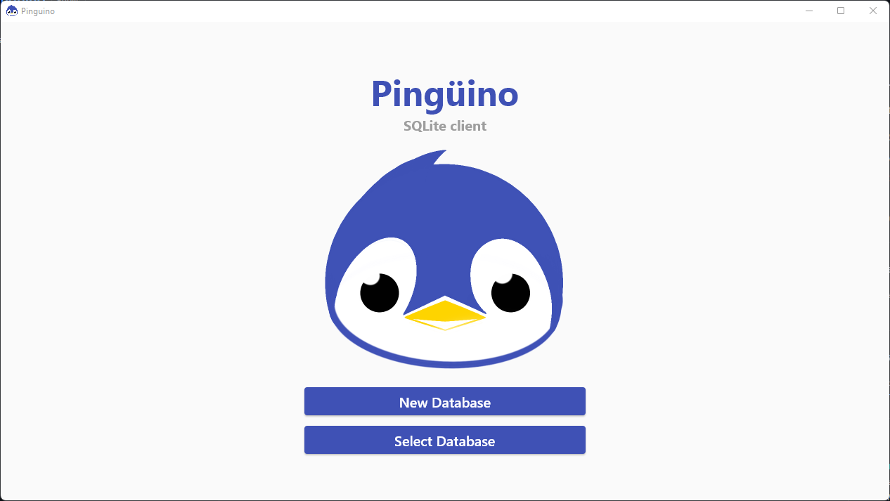
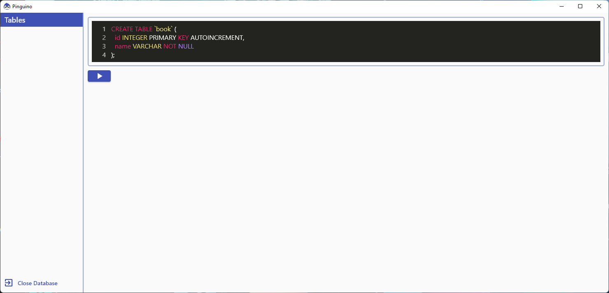
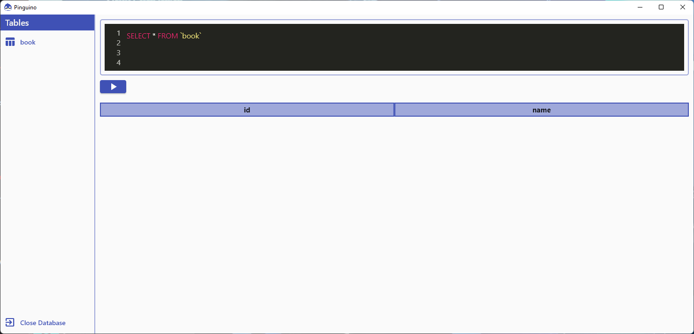
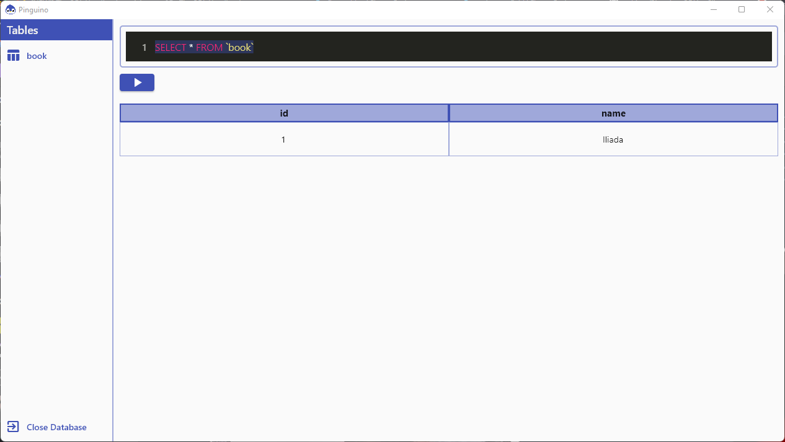

# Crear nuestra primera base de datos.
Para este tutorial usaremos [Pingüino](https://github.com/ushieru/Pinguino) un cliente para SQLite.

Para crear una base de datos solo damos clic en ***New Database*** y la guardamos con el nombre ***biblioteca-v1.sql***



## Manos a la obra

Para crear una tabla con SQL se usa la siguiente sintaxis:

```sql
CREATE TABLE `nombre de tu tabla` (
    nombreDeLaColumna TipoDeDato [Opciones]
);
```

Asi que para crear nuestra tabla para libros usaremos el siguiente SQL:

```sql
CREATE TABLE `book` (
  id INTEGER PRIMARY KEY AUTOINCREMENT,
  name VARCHAR NOT NULL
);
```

> **PRIMARY KEY** - Para indicar que este campo sera nuestro identificador irrepetible.
> 
> **AUTOINCREMENT** - Esto hace que la misma base de datos autogestione los identificadores.
>
> **NOT NULL** - Indica que este campo no puede ser nulo, por lo que no podemos agregar un nuevo registro si no tiene un nombre.



Se debe ver la tabla que creamos en la parte izquiera, si damos clic en el nombre de la tabla podremos ver su contenido.



Prodemos notar que en el campo de texto el comando cambio a:

```sql
SELECT * FROM `book`
```

El cual quiere decir que traera todos los campos y registros de la tabla **book**. Como podemos notar: la tabla esta vacia, que tal si empezamos a ingresar datos?

Para insertar datos con SQL se usa la siguiente sintaxis:

```sql
INSERT INTO `nombre de tu tabla` (columna1, columna2, columna3, ...etc)
VALUES (valor1, valor2, valor3, ...etc);
```

Asi que para ingresar datos en **book** usaremos el siguiente script:

```sql
INSERT INTO `book` (name)
VALUES ('Iliada');
```

Despues de insertar el nuebro libro hay que volver a dar clic en la tabla **book**; para hacer select y refrescar los datos:



> Detengamonos a analizar la query que usamos hace un segundo. Insertamos dentro de **book** en la columna **name** el valor de 'Iliada' pero nosotros nunca agregamos un valor para el identificador en nuestra query **INSERT**. Es especificamente para eso que le agregamos **AUTOINCREMENT** al ***id*** al momento de crear la tabla **book**.
